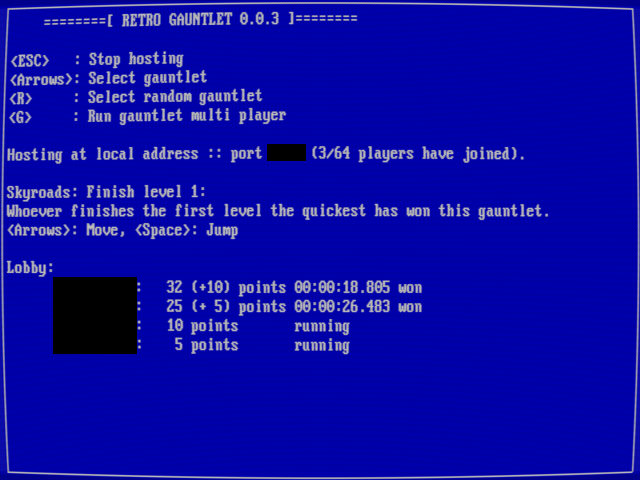

# Retro Gauntlet

Retro Gauntlet is a wrapper for the [libretro](https://www.libretro.com/) API to host and join races of your favorite retro games locally or over the internet.

## Copyright

Retro Gauntlet is distributed under the GNU General Public License version 3, please see COPYING and SOURCES.

## Installation

Simply extract the archive containing the [latest release](/releases/latest) for your operating system to a folder of your choice and run the executable:

`./retrogauntlet`

Optionally you can provide a different data directory as a command line argument

`./retrogauntlet ../my_other_data_folder`

Necessary libretro cores (emulators) can be found [here](https://buildbot.libretro.com/nightly/) for the operating system of your choice.

## Adding a game to the playlist

Internally Retro Gauntlet monitors the memory of emulated games to check for certain conditions (e.g., whether the value of a byte at a certain address becomes equal to 1).
Based on these conditions a player win or loss is triggered.

To make this work you need to identify which areas in memory contain relevant win/loss data, which will be different for each game separately.
Retro Gauntlet contains some simple memory inspection functionality to make this possible.

Use <kbd>Pause</kbd> to pause emulation, inspect the emulator's memory, and save/load snapshots of the game state.

TODO: Add Skyroads example.

## How to play online

For the host:
1. Ensure that `playlist.txt` contains the games you want to play and that the games have been set up correctly.
2. Edit `menu.ini` to change set up your network port, game password, and player name. Ensure the selected network port is open in your firewall and router to enable remote play.
2. Start `retrogauntlet`.
3. Press <kbd>F1</kbd> to host.
4. Invite your friends to join.
5. Select the gauntlet you want to run using <kbd>R</kbd>, <kbd>Up</kbd>, <kbd>Down</kbd> and start it by pressing <kbd>G</kbd>.

For the clients:
1. Edit `menu.ini` to contain the same network port and password as used by the host and set up your player name.
2. Start `retrogauntlet`.
3. Copy the IPv4-address of the host to the clipboard with <kbd>Ctrl</kbd>+<kbd>C</kbd>.
4. Press <kbd>F2</kbd> in Retro Gauntlet to connect to the host.

## Compilation

Please ensure that the following libraries are available in your build environment:
1. OpenGL libraries.
2. GLEW OpenGL Extension Wrangler Library (libglew-dev).
3. SDL 2 Simple DirectMedia Layer (libsdl2-dev).
4. SDL 2 mixer library (libsdl2-mixer-dev).

For Windows compilation an [msys2](https://www.msys2.org/) installation is strongly recommended and the Winsock 2 library must be available for networking support.

### Using `make`

Follow these steps in the root of the repository:

1. Optionally update `Makefile` to work on your system.
2. `make`

This builds the executable `build/retrogauntlet`.

### Using `CMake`

Run the following commands in the root of the repository:

1. `mkdir build`
2. `cd build`
3. `cmake ..`
4. `make` or `ninja`
